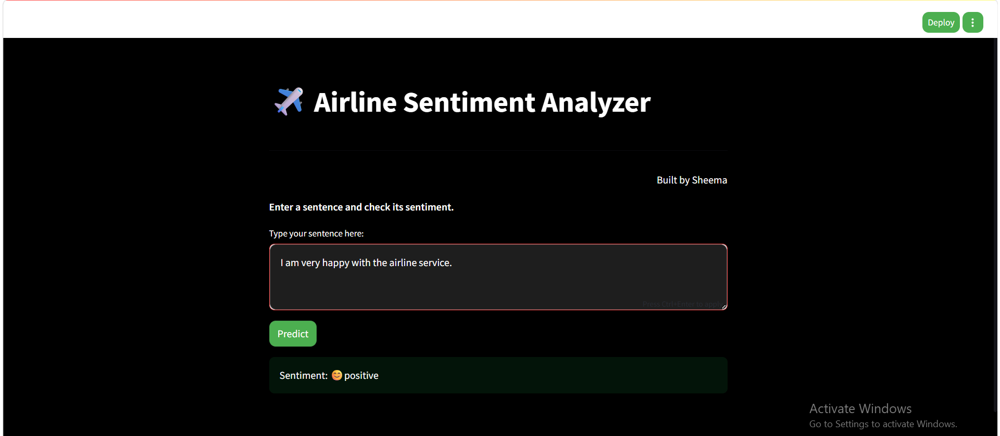

# ✈️ Airline Tweet Sentiment Analysis App

This project is a **Natural Language Processing (NLP)** web application that analyzes airline-related tweets and predicts their sentiment as:

* 😊 Positive
* 😐 Neutral
* 😠 Negative

The application is built using **Streamlit** and powered by a **Deep Learning model (Bidirectional LSTM)**.

---

## 🚀 Live Demo

👉 [Click here to use the app](https://sentimentanalysisapp-sb4c9wnguref62nbujvfyh.streamlit.app/)

📱 Mobile Users: If the app shows a blank screen, open the link in Chrome or Safari.

---

## 📸 App Preview

Below is the Streamlit interface of the application:

---

## 🧠 Model Overview

* Model Type: Bidirectional LSTM
* Embedding Layer: Converts words into vectors
* Input Length: 200 tokens
* Output Classes: 3 (Positive, Neutral, Negative)
* Model Accuracy: 79%

---

## ⚙️ Technologies Used

* Python
* TensorFlow / Keras
* NLTK
* Pandas
* Scikit-learn
* Streamlit

---

## 📊 Dataset

This project uses the Twitter Airline Sentiment dataset from Kaggle.

Download it from:
https://www.kaggle.com/datasets/crowdflower/twitter-airline-sentiment

After downloading, place the file in the project folder as:
Tweets.csv

---

## 📂 Project Structure

- **page.py** → Streamlit UI (main app)  
- **test.py** → Prediction logic  
- **model.h5** → Trained deep learning model  
- **tokenizer.pkl** → Tokenizer for text processing  
- **requirements.txt** → Dependencies  
- **README.md** → Project documentation  

---

## 🔄 How It Works

1. User enters a sentence in the web app
2. Text is preprocessed (lowercase + stopword removal)
3. Tokenizer converts text into sequences
4. Sequences are padded to fixed length
5. Model predicts sentiment
6. Result is displayed 

---

## 🛠️ How to Run Locally

1. Clone the repository:
   git clone <your-repo-link>

2. Navigate to project folder:
   cd <your-folder>

3. Install dependencies:
   pip install -r requirements.txt

4. Run the app:
   streamlit run page.py

---

## 💡 Example

Input:
"The airline service was excellent!"

Output:
Positive 😊

---

## 👩‍💻 Author

**Sheema Sultana**.
Aspiring Data Scientist | NLP Enthusiast

---

## 🌟 Future Improvements

* Improve model accuracy
* Add more datasets
* Deploy with better UI enhancements
* Add real-time tweet analysis

---
